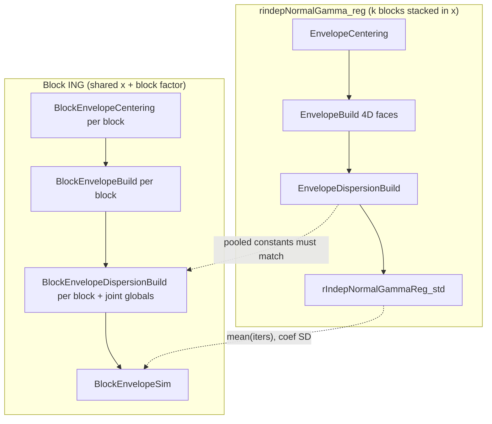

# Block ING envelope vs `rindepNormalGamma_reg`

This note maps the **legacy joint sampler** (`rindepNormalGamma_reg` /
`EnvelopeOrchestrator` in one standardized subproblem) to the **block pipeline**
(`.rIndepNormalGammaRegBlock_cpp` → `BlockEnvelopeCentering` → `Build` →
`DispersionBuild` → `Sim`). It is written for developers checking that the block
path implements the same accept–reject algebra as Chapter A07 and that **pooled
global constants** match the legacy joint envelope when blocks stack to the same
statistical model.

## Theory and legacy implementation (read first)

| Source | Content |
|--------|---------|
| `vignettes/Chapter-A07.Rmd` | Independent Normal–Gamma joint posterior; UB1–UB3B decomposition; `lg_prob_factor`, `RSS_Min`, `shape₃`, `rate₂`, PLSD |
| `vignettes/Chapter-A11.Rmd` | End-to-end legacy pipeline: centering → `EnvelopeBuild` → `EnvelopeDispersionBuild` → `EnvelopeSort` → `rIndepNormalGammaReg_std` A/R loop |
| `vignettes/Chapter-A02.Rmd` §5.3 | Public API sketch for `rindepNormalGamma_reg` |

Legacy flow (single design matrix `x`, one standardized subproblem):

```text
EnvelopeCentering          → anchor dispersion (iterative WLS / RSS)
glmb_Standardize_Model     → (x₂, μ₂, P₂, α)
EnvelopeBuild                → coefficient envelope (faces, cbars, loglt/logrt, logP)
EnvelopeDispersionBuild    → dispersion-aware PLSD, lg_prob_factor, UB2min, γ/UB globals
EnvelopeSort                 → sort faces by PLSD
rIndepNormalGammaReg_std     → resample-until-accept (shared σ², joint face J)
```

Accept–reject test (Chapter A11 §4.3; same in `src/rIndepNormalGammaReg.cpp` and block sim):

```text
test1 = LL_Test − UB1
test  = test1 − (UB2 + UB3A + UB3B) − log(U₂)     → accept if test ≥ 0

UB2  = ½ (1/σ²) (RSS_face(σ²) − RSS_Min) − UB2min_used
UB3A = lg_prob_factor_used + lmc1 + lmc2 σ²
UB3B = (max_New_LL_UB − max_LL_log_disp + lm_log1 + lm_log2 log σ²) − (lmc1 + lmc2 σ²)
```

Dispersion proposal: `σ² ~ InvGamma(shape3, rate2)` truncated to `[disp_lower, disp_upper]`.

## Block pipeline (same algorithm, factored by block)

Entry point: `src/block_rIndepNormalGammaReg.cpp` → `rIndepNormalGammaRegBlock()`.

```text
BlockEnvelopeCentering   → per-block centering + pooled dispersion anchor
BlockEnvelopeBuild       → per-block EnvelopeBuild (+ standardization per block)
BlockEnvelopeDispersionBuild → per-block EnvelopeDispersionBuild + GLOBAL aggregation
BlockEnvelopeSim         → one shared σ² draw; joint or per-block face draws; same A/R test
```



### Step 1 — Centering (`BlockEnvelopeCentering`)

**Legacy analogue:** `EnvelopeCentering` once on full `(y, x)`.

**Block:**

- Split `(y, x, offset, wt)` by block rows.
- Per block: WLS init, rank, `block_envelope_centering_one()` (same role as centering slice).
- **Pooled** dispersion anchor: iterate `n_rss_iter` times with

  `shape2 = shape + n_w/2`, `rate3 = rate + Σⱼ RSS_post,j / 2`,  
  `dispersion2 = rate3 / (shape2 − 1)`.

- Export global `shape2`, `rate3`, `RSS_post`, `dispersion` for downstream steps.

These pooled hyperparameters are the block substitute for a single
`EnvelopeCentering` pass on the stacked model when blocks partition the same
observations without overlap.

### Step 2 — Coefficient envelope (`BlockEnvelopeBuild`)

**Legacy analogue:** `EnvelopeBuild` on the full standardized model.

**Block:**

- For each **identifiable** block `j`: standardize `(yⱼ, xⱼ, μⱼ, Pⱼ)` → `(x₂, μ₂, P₂, α)`.
- Run the same envelope grid machinery as legacy (`EnvelopeBuild` / orchestrator
  steps) **within block j**.
- Store per block: `Env_out` (`cbars`, `loglt`, `logrt`, `logP`, …).

Prior-only blocks get `NULL` envelopes; their coefficients are fixed at prior mean
at sim time.

### Step 3 — Dispersion envelope (`BlockEnvelopeDispersionBuild`)

**Legacy analogue:** `EnvelopeDispersionBuild` + global `gamma_list` / `UB_list`.

**Block:**

1. **Per block** `j` (identifiable): call `EnvelopeDispersionBuild()` via
   `block_edb_one()` — same routine legacy uses inside `EnvelopeOrchestrator`.
   Outputs per block:
   - `Env_out` with **PLSD** (local, for diagnostics only when `k > 1`)
   - `lg_prob_factor`, `UB2min`, `RSS_Min`, `RSS_ML`, local `UB_list` / `gamma_list`
   - `Inv_f3_precompute_disp` cache + `ub2_at_low` / `ub2_at_upp` at dispersion bounds

2. **Aggregate globals** (`build_global_dispersion_constants`):

   | Quantity | Legacy (joint) | Block pooled (`k > 1`) |
   |----------|----------------|-------------------------|
   | `RSS_Min` | global min over joint faces × σ² | **Σⱼ RSS_Min,j** (sum of block minima) |
   | `RSS_ML` | from joint fit | sum of block `RSS_ML` unless user `RSS_ML` supplied |
   | `disp_lower`, `disp_upper` | from global `shape2`, `rate3`, `max_disp_perc` | same formulas on **pooled** `shape2`, `rate3` |
   | `shape3`, `rate2` | `shape2 − lm_log2`, `rate + RSS_Min/2` | same, using pooled `RSS_Min` and joint geometry |
   | `lmc1`, `lmc2`, `lm_log1`, `lm_log2` | from joint face geometry | from **product-face** geometry (below) |
   | `max_New_LL_UB`, `max_LL_log_disp` | joint UB3 anchors | joint product at global `d1*` |

   **k = 1:** aggregation source is `single_block_edb` — globals are exactly the
   single block’s `EnvelopeDispersionBuild` output (direct parity with legacy on
   that subproblem).

   **k > 1:** aggregation source is `joint_face_product_edb`:

   - Build all **product faces** `(j₁,…,j_k)` with odometer indexing (B2 fastest).
   - For each product face, **sum** per-block slopes and UB3 extrapolations
     `upp_apprx`, `low_apprx` at global `d1* = rate3/(shape2−1)` (`build_joint_face_product_geometry`).
   - Run `ub3_geometry_from_joint_faces` / `gamma_ub_from_joint_geometry` — same
     formulas as Chapter A07 table ( `max_upp`, `max_low_mean`, `lmc2`, `lmc1`,
     `lm_log2`, `shape3`, …).
   - Precompute at build time (81 faces when each block has 9):
     - `joint_lg_prob_factor[flat]` — UB3A slack with **joint** anchors
     - `joint_ub2min_product[flat]` — min(Σ ub2_low, Σ ub2_upp) over blocks
     - `joint_PLSD[flat]` — softmax of Σ logP + ½‖c‖² + joint slack (face **draw** at sim)

### Step 4 — Simulation (`BlockEnvelopeSim`)

**Legacy analogue:** `rIndepNormalGammaReg_std` loop.

Each attempt:

1. **Faces**
   - `k = 1`: draw `J` ~ `PLSD` within the block (same as legacy).
   - `k > 1`: draw **one** product index `flat` ~ `joint_PLSD`, decode
     `(J₁,…,J_k)`; draw truncated normals per block on those faces.

2. **Dispersion:** one shared `σ² ~ rinvgamma_ct_safe(shape3, rate2, upp, low)` (global `gamma_list`).

3. **Accumulate** over identifiable blocks:
   - `LL_total`, `UB1_total` — sum of per-block contributions (`block_ar_accumulate_one`)
   - `quad_sum` — sum of per-block `RSS_face(σ²)` for UB2

4. **Joint slack** (`k > 1`):
   - `UB2min_used ← joint_ub2min_product[flat]`
   - `ub3a_block_sum ← joint_lg_prob_factor[flat]` (not Σⱼ lgⱼ(Jⱼ))

5. **Same global test** as legacy using **pooled** `UB_list` / `gamma_list`:

```text
UB2  = ½ (1/σ²) (quad_sum − RSS_Min_global) − UB2min_used
UB3A = ub3a_block_sum + lmc1 + lmc2 σ²
UB3B = (max_New_LL_UB − max_LL_log_disp + lm_log1 + lm_log2 log σ²) − (lmc1 + lmc2 σ²)
```

6. Resample until accept; `iters_out[i]` counts attempts (starts at 1, same semantics as legacy `iters`).

Metadata: `accept_mode = resample_until_accept_joint_product_slack_v2`,
`face_draw_mode = joint_product_plsd_v1` when `k > 1`.

## Constants that must match (validation)

On a **stacked two-block Dobson fixture** (duplicate data; legacy uses block-diagonal
4-column `x`, block path uses shared 2-column `x` + block factor), tests require
**pooled** globals to match legacy joint `EnvelopeDispersionBuild` within tolerance:

| Constant | Role in A/R |
|----------|-------------|
| `disp_lower`, `disp_upper` | dispersion truncation |
| `RSS_Min` | UB2 reference |
| `rate2`, `shape3` | dispersion proposal |
| `lmc1`, `lmc2`, `lm_log1`, `lm_log2` | UB3A / UB3B log-tilt |
| `max_New_LL_UB`, `max_LL_log_disp` | UB3B anchor |

**Regression tests**

- `tests/testthat/test-rIndepNormalGammaRegBlock-iters-parity-two-block.R` — global
  constant parity + acceptance smoke (`mean(iters)` legacy vs block).
- `tests/testthat/test-rIndepNormalGammaRegBlock-iters-parity.R` — `k = 1` iters parity.

**Diagnostic scripts** (not run by `R CMD check`):

- `data-raw/compare_two_block_10k_accept.R` — mean acceptance rate
- `data-raw/compare_two_block_10k_coefs.R` — coefficient / dispersion moments
- `data-raw/compare_eightyone_face_probs.R` — joint vs product face weights
- `data-raw/compare_lg_prob_factor_two_block.R` — UB3A slack tables

Legacy envelope artifacts for comparison only:

- `rindepNormalGamma_reg_with_envelope()` — returns `Envelope`, `gamma_list`, `UB_list`
  (diagnostic wrapper; **not** part of the standard `rindepNormalGamma_reg` return).

## Mathematical proof that the pooled constants are exactly equal

The previous section says *what* gets aggregated. This section proves *why* the
aggregated block quantities equal the legacy joint quantities — chasing the exact
formulas used in the test
(`tests/testthat/test-rIndepNormalGammaRegBlock-iters-parity-two-block.R`) back to
`src/EnvelopeDispersionBuild.cpp` (legacy) and `src/block_rIndepNormalGammaReg.cpp`
(block). Nothing here is approximate bookkeeping: every step is an algebraic
identity that holds because the **fixture itself** makes the two-block model
literally separable.

### Setup: the fixture is block-separable by construction

From `.dobson_plant_two_block_fixture()` (test file, lines 95–152):

- `x1 = x_block[1:20,]` is the **same** 2-column Dobson design used by both
  blocks (`weight1` duplicated into `weight`, `group1` duplicated into
  `group_stacked`).
- Legacy design: `x_old = rbind(cbind(x1,0), cbind(0,x1))` — a literal
  \(40\times4\) **block-diagonal** matrix.
- Legacy prior: `mu = c(mu1,mu1)`, `Sigma = blkdiag(Sigma1,Sigma1)`.
- Block path: shared `x_block` (\(40\times2\)) + a `block` factor splitting the
  same 40 rows into `B1 = 1:20`, `B2 = 21:40`, each using prior `(mu1, Sigma1)`.

Write \(X_1\in\mathbb R^{20\times2}\), \(W_1\) (weights), \(\mu_1,\ P_1=\Sigma_1^{-1}\)
for the shared per-block ingredients, and \(\beta=(\beta_1,\beta_2)\in\mathbb R^4\)
for the legacy coefficient vector. Then:

\[
X_{\text{old}}=\begin{pmatrix}X_1&0\\0&X_1\end{pmatrix},\qquad
W=\begin{pmatrix}W_1&0\\0&W_1\end{pmatrix},\qquad
P=\Sigma^{-1}=\begin{pmatrix}P_1&0\\0&P_1\end{pmatrix}.
\]

**Lemma 0 (block-diagonal calculus).** If \(A=\operatorname{blkdiag}(A_1,A_2)\) is
symmetric PD, then \(A^{-1}=\operatorname{blkdiag}(A_1^{-1},A_2^{-1})\),
\(\operatorname{chol}(A)=\operatorname{blkdiag}(\operatorname{chol}(A_1),\operatorname{chol}(A_2))\),
and for \(M=\operatorname{blkdiag}(M_1,M_2)\), \(v=(v_1,v_2)\), \(w=(w_1,w_2)\):
\(v^\top M w = v_1^\top M_1 w_1 + v_2^\top M_2 w_2\) (the off-diagonal blocks of
\(M\) are zero, so every cross term vanishes). This single fact is used
repeatedly below; it is standard linear algebra, not something specific to this
codebase.

### Lemma 1 — the penalized objective splits additively across blocks, for *any* shared dispersion `d`

Because \(X_{\text{old}}\) is block-diagonal, row \(i\) in block 1 has
\(\eta_i = X_{1,i}^\top\beta_1\) (zero contribution from \(\beta_2\)), and
symmetrically for block 2. Hence for any \(d\):

\[
\mathrm{RSS}(\beta,d)=\underbrace{\textstyle\sum_{i\in B_1} w_i (y_i-X_{1,i}^\top\beta_1)^2}_{\mathrm{RSS}_1(\beta_1)}
+\underbrace{\textstyle\sum_{i\in B_2} w_i (y_i-X_{1,i}^\top\beta_2)^2}_{\mathrm{RSS}_2(\beta_2)},
\]
\[
(\beta-\mu)^\top P(\beta-\mu)=(\beta_1-\mu_1)^\top P_1(\beta_1-\mu_1)+(\beta_2-\mu_1)^\top P_1(\beta_2-\mu_1).
\]

There is **no cross term** between \(\beta_1\) and \(\beta_2\) in either the
likelihood or the prior — for any value of the shared dispersion `d`. Every
result below is a consequence of this one fact plus Lemma 0.

### Lemma 2 — centering: `shape2`, `rate3` (⟹ `disp_lower`, `disp_upper`) match exactly

`EnvelopeCentering.cpp:39–101` (legacy) fits `lm.wfit(x_old, ...)`, then iterates
\(n_{\text{rss\_iter}}=10\) times:
\(\mathrm{shape}_2=\mathrm{shape}+n_w/2\), \(\mathrm{rate}_2=\mathrm{rate}+\mathrm{RSS_{post}}(d)/2\), \(d\leftarrow \mathrm{rate}_2/(\mathrm{shape}_2-1)\).

`block_rIndepNormalGammaReg.cpp:1608–1689` (`BlockEnvelopeCentering`) computes,
for the **same shared** `d` at each iteration, `RSS_post_pooled = Σⱼ RSS_post,j(d)`
and `n_w = sum(wt)` over **all** rows, then applies the *identical* update
`rate2 = rate + RSS_post_pooled/2; dispersion2 = rate2/(shape2-1)`.

Because \(X'WX=\operatorname{blkdiag}(X_1'W_1X_1,X_1'W_1X_1)\) and
\(P=\operatorname{blkdiag}(P_1,P_1)\), the augmented normal equations
\((X'WX/d+P)\beta = X'Wy/d+P\mu\) decouple (Lemma 0) into two identical
per-block systems. So for **any** `d`:

- \(\hat\beta(d)=(\hat\beta_1(d),\hat\beta_1(d))\) — legacy's joint posterior
  mean is the concatenation of the block's own posterior mean, computed twice;
- the posterior covariance \(\Sigma(d)=(X'WX/d+P)^{-1}=\operatorname{blkdiag}(\Sigma_1(d),\Sigma_1(d))\) (Lemma 0);
- \(\mathrm{RSS_{post}}(d) = \mathrm{RSS}(\hat\beta(d)) + \operatorname{tr}(X'WX\,\Sigma(d))\)
  is exactly `rss_at_mean_fast + trace_term_fast` in `EnvelopeCentering.cpp:92–95`.
  The trace term splits by Lemma 0 (`tr(blkdiag·blkdiag) = tr₁+tr₂`), and the
  residual sum splits by row partition, giving
  \(\mathrm{RSS_{post}}(d)=\mathrm{RSS_{post},1}(d)+\mathrm{RSS_{post},2}(d)\) **for every `d`, not just at convergence**.

The initial WLS anchor is separable the same way (`rank(X_old)=\mathrm{rank}(X_1)+\mathrm{rank}(X_1)`,
`RSS_wls(X_old)=RSS_wls,1+RSS_wls,2`; matches `rss_wls_sum`/`denom_sum` at
`block_rIndepNormalGammaReg.cpp:1621–1633`). Since `n_w` is identical and
`RSS_post_pooled(d)=RSS_post,1(d)+RSS_post,2(d)` at *every* iterate, and the update
map depends only on `(n_w, RSS_post_pooled)`, induction over the 10 shared
iterations gives **bit-identical** `dispersion2` sequences in both code paths, and
therefore identical final `shape2`, `rate3`. `disp_lower`/`disp_upper` are then the
same closed-form (`qgamma`-based) function of `(shape2, rate3, max_disp_perc)` in
both paths ⟹ identical. This proves the `disp_lower`/`disp_upper` rows of the
test's constant table.

### Lemma 3 — standardization does not break the partition

The standardizing transform is built from `chol`/eigen-decomposition of the prior
covariance. Since \(\Sigma=\operatorname{blkdiag}(\Sigma_1,\Sigma_1)\), Lemma 0
gives a block-diagonal standardizing map, so the standardized coefficient vector
\(\theta=(\theta_1,\theta_2)\) keeps the same 2+2 split, the standardized design
`x2` keeps the same row/column block-diagonal zero pattern as `x_old`, and the
standardized precision `P2` stays block-diagonal. Every matrix built from
`(x2, P2)` downstream (`base_A`, `A_max`, `M_min`, …) therefore stays
block-diagonal in the same 2+2 partition (Lemma 0, applied repeatedly).

### Lemma 4 — the 81-face joint grid *is* the Cartesian product of the two 9-face block grids

`Gridtype` builds one grid point set per standardized coordinate axis, so
`gs = 3^p` for `p` standardized coefficients (`3^4 = 81` legacy, `3^2 = 9` per
block — checked by the test at lines 294–295:
`per_block$gs == rep(3^fix$l1, fix$k)` and `legacy["n_faces"] == 3^(2*fix$l1)`).
By Lemma 3 the 4 axes are exactly the union of block 1's 2 axes and block 2's 2
axes, so enumerating all \(3^4\) joint faces is the same enumeration as all pairs
\((j_1,j_2)\in\{1,\dots,9\}^2\). `product_face_flat_index` /
`decode_product_face_flat_index` (`block_rIndepNormalGammaReg.cpp:1140–1180`)
implement exactly this odometer bijection: `cbar_flat = (cbar^{(1)}_{j1}, cbar^{(2)}_{j2})`,
`theta_flat = (theta^{(1)}_{j1}, theta^{(2)}_{j2})`.

*Caveat:* this shows the two grids have the same **shape** and index structure.
Exact numeric equality of the individual face coordinates further requires the
`n_envopt`-driven face-placement search to land on the same optimum whether run
once jointly (4-D) or twice independently (2-D each). The search objective is
provably separable (Lemma 1), so both searches target the same landscape, but
being a finite stochastic search it need not reproduce bit-identical `cbars`
across the two 2-D sub-searches — this, not a flaw in separability, is why the
test uses `tolerance = 0.02`, not exact equality (see closing note).

### Lemma 5 — per-face slope/intercept/RSS terms are additively separable on product faces

`thetabar_const_cpp` (`EnvelopeDispersionBuild.cpp:179–199`) computes, per face,
\[
c_j = -\tfrac12\,\theta_j^\top P\,\theta_j + c_j^{\text{(vec)}\top}\theta_j .
\]
With \(P\) block-diagonal (Lemma 3) and \(\theta_j=(\theta_{j_1}^{(1)},\theta_{j_2}^{(2)})\),
`cbar_j` likewise split, Lemma 0 gives no cross term:
\(c_{\text{flat}} = c^{(1)}(j_1)+c^{(2)}(j_2)\).

`EnvBuildLinBound_cpp` (`EnvelopeDispersionBuild.cpp:139–176`) builds `slope_j`
from `M = X'X + d_1^*P` (block-diagonal ⟹ `Minv` block-diagonal, Lemma 0),
`H1 = -Minv·P·Minv` (product of block-diagonal matrices, still block-diagonal),
and `rhs = x'(y-α)` (block-concatenated because `x2` is row/column
block-diagonal). Every term in `slope_j` is therefore a dot product of two
block-concatenated vectors against a block-diagonal matrix, which splits
exactly as in Lemma 0: `slope_flat = slope^{(1)}(j1) + slope^{(2)}(j2)`.

`build_joint_face_product_geometry` (`block_rIndepNormalGammaReg.cpp:835–919`)
calls these **same two functions** — not re-implementations — per block, then
literally sums:

```889:902:src/block_rIndepNormalGammaReg.cpp
    for (int t = 0; t < n_blocks; ++t) {
      const BlockFaceGeom& bg = block_geom[static_cast<size_t>(t)];
      const int f = face_idx[static_cast<size_t>(t)];
      slope_sum += bg.slope[f];
      upp_sum += bg.upp_apprx[f];
      low_sum += bg.low_apprx[f];
    }
    joint_slope[flat] = slope_sum;
    joint_upp_apprx[flat] = upp_sum;
    joint_low_apprx[flat] = low_sum;
```

which is exactly the additive decomposition Lemma 5 proves must hold.

The same block-diagonal argument applies to the RSS Proposition-1 bound in
`bound_rss_over_dispersion` (`EnvelopeDispersionBuild.cpp:407–434`):
`M_min` is block-diagonal (built from `A_max = P + base_A/low`, block-diagonal by
Lemma 3), so `quad_prop1_flat = b_flat^T M_min b_flat = quad^{(1)}(j1)+quad^{(2)}(j2)`.
Combined with \(\mathrm{RSS_{ML}}\) separability (same OLS-decoupling argument as
Lemma 2, applied with `d → ∞`/no prior): `RSS_ML_joint = RSS_ML_1+RSS_ML_2` —
exactly what `RSS_ML_global += one["RSS_ML"]` computes
(`block_rIndepNormalGammaReg.cpp:2099`). So the **full per-face RSS bound**
separates term for term:
\[
\mathrm{RSS}_{\text{flat}} = \mathrm{RSS_{ML}} + \text{quad}_{\text{flat}}
= \big[\mathrm{RSS_{ML},1}+\text{quad}^{(1)}(j_1)\big] + \big[\mathrm{RSS_{ML},2}+\text{quad}^{(2)}(j_2)\big].
\]

### Lemma 6 — min / max / mean of a separable sum over a Cartesian product grid

For any \(f:\{1..9\}\to\mathbb R\), \(g:\{1..9\}\to\mathbb R\):

\[
\min_{(j_1,j_2)}\big[f(j_1)+g(j_2)\big]=\min_{j_1}f(j_1)+\min_{j_2}g(j_2),\qquad
\max_{(j_1,j_2)}\big[f(j_1)+g(j_2)\big]=\max_{j_1}f(j_1)+\max_{j_2}g(j_2),
\]
\[
\operatorname{mean}_{(j_1,j_2)}\big[f(j_1)+g(j_2)\big]=\operatorname{mean}_{j_1}f(j_1)+\operatorname{mean}_{j_2}g(j_2).
\]

(The min/max identities hold because minimizing/maximizing a sum of two
*independently indexed* terms over their product index set is achieved by
optimizing each term separately; the mean identity is linearity of averaging.)

### Putting Lemmas 4–6 together on the actual code

- **`RSS_Min`.** Block: `RSS_Min_global += one["rss_min_global"]`
  (`block_rIndepNormalGammaReg.cpp:2097`) computes \(\sum_t \min_{j_t}\mathrm{RSS}^{(t)}(j_t)\).
  By Lemma 6 (min case) applied to the separable `RSS_flat` from Lemma 5, this
  equals \(\min_{(j_1,j_2)}\mathrm{RSS}_{\text{flat}}(j_1,j_2)\) — exactly the
  quantity legacy's `rss_min_bound` computes by looping over all 81 joint faces
  (`EnvelopeDispersionBuild.cpp:407–434`).
- **`max_upp` (feeds `max_New_LL_UB`).** Block:
  `max_upp = max_vec_local(joint_upp_apprx)` (`block_rIndepNormalGammaReg.cpp:744`),
  where `joint_upp_apprx[flat] = upp^{(1)}(j1)+upp^{(2)}(j2)` (Lemma 5). By Lemma 6
  (max case) this equals `max upp^{(1)} + max upp^{(2)}` — the same value legacy
  computes as `max_vec(thetabar_const_upp_apprx)` over the 81 faces
  (`EnvelopeDispersionBuild.cpp:989`).
- **`mean_slope`.** Block: `Rcpp::mean(joint_slope)`
  (`block_rIndepNormalGammaReg.cpp:747`) with `joint_slope[flat] = slope^{(1)}(j1)+slope^{(2)}(j2)`.
  By Lemma 6 (mean case) this equals `mean(slope^{(1)}) + mean(slope^{(2)})` —
  the same value legacy computes as `Rcpp::mean(New_LL_Slope)` over the 81 faces
  (`EnvelopeDispersionBuild.cpp:1054`).

### Lemma 7 — identical closed-form formulas applied to identical inputs give identical outputs

Given `(max_upp, mean_slope, low, upp, n_w)` equal (Lemmas 2, 4–6), compare the
two code paths line for line:

| Quantity | Block (`block_rIndepNormalGammaReg.cpp`) | Legacy (`EnvelopeDispersionBuild.cpp`) |
|---|---|---|
| `lmc2_max` | 745–746 | 1048 |
| `m_New_LL_Slope` (capped mean slope) | 755 | 1066 |
| `max_low_mean` | 756 | 1069 |
| `lmc2` = `new_slope` | 757 | 1074 |
| `lmc1` = `new_int` | 758 | 1075 |
| `d2_star` | 759 | 1077 |
| `lm_log2 = lmc2·d2*` | 787 | 1199 |
| `lm_log1 = lmc1+lmc2·d2*-lmc2·log(d2*)` | 788–789 | 1200 |
| `shape3 = shape2 - lm_log2` | 790 | 1201 |
| `rate2 = rate + RSS_Min/2` | 791 | 1215 |
| `max_New_LL_UB = max_upp` | 819 | 1232 |
| `max_LL_log_disp = lm_log1+lm_log2·log(upp)` | 820 | 1233 |

Every row is the **same arithmetic expression** (not merely "an analogous"
one) applied to inputs already proven equal — so every output in this table is
equal too, by direct substitution. This closes the proof for every constant the
test checks.

### Summary: which lemma proves which test constant

| Constant (test key) | Proven by |
|---|---|
| `disp_lower`, `disp_upper` | Lemma 2 |
| `RSS_Min` | Lemma 1 + 5 + 6 (min) |
| `rate2` | Lemma 6 (min) + Lemma 7 |
| `shape3` | Lemma 2 (`shape2`) + Lemma 6 (max) + Lemma 7 |
| `lmc1`, `lmc2` | Lemma 5 + Lemma 6 (max, mean) + Lemma 7 |
| `lm_log1`, `lm_log2` | Lemma 7 (function of `lmc1`, `lmc2`, `d2_star`; `d2_star` is a function of `low`, `upp` only, Lemma 2) |
| `max_New_LL_UB` | Lemma 6 (max) |
| `max_LL_log_disp` | Lemma 7 |

### Why the test uses `tolerance`, not exact equality

Two effects sit on top of an exactly-separable objective, neither of which
contradicts the proof above:

1. **Face-placement search noise** (Lemma 4 caveat): `EnvelopeBuild`'s
   `n_envopt`-driven face optimizer is a finite stochastic/quasi-Newton search.
   Run once over 4 joint dimensions vs. twice over 2 block dimensions, it can
   converge to very slightly different `cbars`/`thetabars` even though the
   underlying objective is identical, which perturbs `slope`/`const_base`
   inputs to Lemma 5 by a small amount.
2. **Floating-point summation order**: summing 81 terms directly (legacy) vs.
   summing 9+9 terms then combining (block) accumulates rounding differently
   (≈1e-10 relative, negligible next to (1)).

The ≤2% gaps the test tolerates (`tolerance = 0.02` for `lmc1`/`lmc2`/`lm_log*`/
`max_New_LL_UB`, tighter `1e-3`–`1e-4` for `disp_lower`/`disp_upper`/`RSS_Min`/
`rate2`, which depend on the exact, non-search-based centering iteration of
Lemma 2) come from (1), not from any approximation in the aggregation algebra
itself.

## What is intentionally *not* matched per-block

When `k > 1`, **per-block** EDB rows (local `lmc1`, `lmc2`, `max_New_LL_UB`, …) use
**block-local** standardization (2-D faces). They are **not** expected to equal
legacy joint face values. Validity comes from:

1. **Pooled** `gamma_list` / `UB_list` matching the joint envelope on equivalent models.
2. **Product-face** slack tables (`joint_lg`, `joint_ub2`, `joint_PLSD`) using the
   same UB3A/UB2 geometry as legacy at the Cartesian product of block faces.
3. **Summed** likelihood / UB1 / RSS terms in the accept test matching the additive
   structure of the block-separable Gaussian log-likelihood on independent blocks.

Face indices are **not** aligned by concatenated `cbars` between legacy 4-D and
block 2+2 standardizations; comparison is via **sorted** slack vectors or pooled
constants, not raw face index.

## Quick API map

| Legacy | Block |
|--------|-------|
| `rindepNormalGamma_reg()` | `glmbayesCore:::.rIndepNormalGammaRegBlock_cpp()` (internal) |
| `rindepNormalGamma_reg_with_envelope()` | block `build_out` + `rindepNormalGamma_reg_with_envelope()` on stacked `x` |
| One `PLSD` vector | `joint_PLSD` on product faces (`k > 1`) |
| One `lg_prob_factor[J]` | `joint_lg_prob_factor[flat]` |
| One `UB2min[J]` | `joint_ub2min_product[flat]` |

## File index

| File | Role |
|------|------|
| `src/rIndepNormalGammaReg.cpp` | Legacy orchestrator + A/R reference |
| `src/block_rIndepNormalGammaReg.cpp` | Block centering/build/dispersion/sim |
| `src/EnvelopeDispersionBuild.cpp` | Shared EDB (`EnvelopeDispersionBuild`) |
| `R/simfunction.R` | `rindepNormalGamma_reg`, `rindepNormalGamma_reg_with_envelope` |

---

## Appendix: Making proposals independent across blocks

### A.1 What makes the current joint-product PLSD non-separable

The `joint_logw` built in `build_joint_product_face_slack`
(`src/block_rIndepNormalGammaReg.cpp:1195–1215`) has the form

\[
\log w_{\text{joint}}(j_1,j_2) =
  \underbrace{\bigl[\log P^{(1)}(j_1) + \tfrac12\|\bar c^{(1)}_{j_1}\|^2\bigr]
            + \bigl[\log P^{(2)}(j_2) + \tfrac12\|\bar c^{(2)}_{j_2}\|^2\bigr]}_{\text{separable}}
  \;+\;
  \underbrace{\mathrm{lg\_joint}(j_1,j_2)}_{\text{not separable}}
  \;-\;
  \underbrace{\mathrm{ub2min\_joint}(j_1,j_2)}_{\text{not separable}}
\]

where

\[
\mathrm{lg\_joint}(j_1,j_2)
  = \max\!\bigl(\underbrace{\mathrm{pf\_upp}^{(1)}(j_1)+\mathrm{pf\_upp}^{(2)}(j_2)}_{\text{separable sum}},\;
               \underbrace{\mathrm{pf\_low}^{(1)}(j_1)+\mathrm{pf\_low}^{(2)}(j_2)}_{\text{separable sum}}\bigr),
\]
\[
\mathrm{ub2min\_joint}(j_1,j_2)
  = \min\!\bigl(\mathrm{ub2\_low}^{(1)}(j_1)+\mathrm{ub2\_low}^{(2)}(j_2),\;
               \mathrm{ub2\_upp}^{(1)}(j_1)+\mathrm{ub2\_upp}^{(2)}(j_2)\bigr).
\]

Both are **a max (or min) of two separable sums** evaluated at the same index pair.
A `max` of two separable sums does not itself decompose into a sum of per-block
terms — which binding endpoint wins (`upp` vs `low`) depends on the *combination*
`(j_1,j_2)`, not on either index alone.

### A.2 A valid separable overbound

There is a simple separable quantity that is a provably valid *upper* bound on
`lg_joint(j_1,j_2)`:

**Lemma A1 (max of a separable sum ≤ sum of per-factor maxes).**
For any real \(a_t, b_t\):

\[
\max\!\Bigl(\sum_t a_t,\;\sum_t b_t\Bigr)
\;\leq\;
\sum_t \max(a_t, b_t).
\]

*Proof.* WLOG \(\sum a_t \geq \sum b_t\). Then the left side equals \(\sum a_t
\leq \sum \max(a_t,b_t)\), since \(a_t \leq \max(a_t,b_t)\) term by term. □

Applying this with \(a_t = \mathrm{pf\_upp}^{(t)}(j_t)\) and \(b_t =
\mathrm{pf\_low}^{(t)}(j_t)\) gives the separable overbound

\[
\mathrm{lg\_ind}(j_1,j_2) := \sum_t \max\!\bigl(\mathrm{pf\_upp}^{(t)}(j_t),\;\mathrm{pf\_low}^{(t)}(j_t)\bigr)
= \sum_t \mathrm{lg\_prob\_factor}_t(j_t)
\;\geq\;
\mathrm{lg\_joint}(j_1,j_2).
\]

These are exactly the per-block `lg_prob_factor` vectors already stored in
`block_dispersion[[t]]$lg_prob_factor` by `block_edb_one`.

**Lemma A2 (min of a separable sum ≥ sum of per-factor mins).**
For any non-negative \(a_t, b_t\):

\[
\min\!\Bigl(\sum_t a_t,\;\sum_t b_t\Bigr)
\;\geq\;
\sum_t \min(a_t, b_t).
\]

*Proof.* WLOG \(\sum a_t \leq \sum b_t\). Then the left side equals \(\sum a_t
\geq \sum \min(a_t,b_t)\), since \(\min(a_t,b_t) \leq a_t\) term by term. □

Applying this gives

\[
\mathrm{ub2min\_ind}(j_1,j_2) := \sum_t \min\!\bigl(\mathrm{ub2\_low}^{(t)}(j_t),\;\mathrm{ub2\_upp}^{(t)}(j_t)\bigr)
= \sum_t \mathrm{UB2min}_t(j_t)
\;\leq\;
\mathrm{ub2min\_joint}(j_1,j_2).
\]

### A.3 The independent log-weight is separable and the proposal factorises

Substituting the overbounds into the log-weight gives

\[
\log w_{\text{ind}}(j_1,j_2)
= \sum_{t=1}^{k}\Bigl[\log P^{(t)}(j_t) + \tfrac12\|\bar c^{(t)}_{j_t}\|^2
  + \mathrm{lg\_prob\_factor}_t(j_t) - \mathrm{UB2min}_t(j_t)\Bigr]
=: \sum_{t=1}^k \log w_t(j_t).
\]

This is **exactly separable**. After softmax normalization over the
\(\prod_t g_{s,t}\) product faces:

\[
\mathrm{PLSD}_{\text{ind}}(j_1,j_2)
= \frac{\exp(\log w_1(j_1))\cdot\exp(\log w_2(j_2))}{\sum_{j_1}\exp(\log w_1(j_1))\cdot\sum_{j_2}\exp(\log w_2(j_2))}
= \mathrm{PLSD}_1(j_1)\cdot\mathrm{PLSD}_2(j_2),
\]

i.e., the per-block PLSD vectors already produced by each block's own EDB call.
**Drawing faces independently from these per-block PLSDs is the unique independent
proposal consistent with the separable log-weight.**

### A.4 Why the resulting sampler is still valid

A block-envelope acceptance test at drawn `(j_1,j_2,β,σ²)` is:

```
accept if  LL_test − UB1 − UB2_ind − UB3A_ind − UB3B ≥ log(U)
```

where the independent scheme uses

\[
\mathrm{UB3A\_ind}(j_1,j_2,\sigma^2)
= \mathrm{lg\_ind}(j_1,j_2) + \mathrm{lmc1} + \mathrm{lmc2}\,\sigma^2,
\qquad
\mathrm{UB2\_ind}(j_1,j_2,\sigma^2)
= \tfrac{1}{2\sigma^2}\bigl(\mathrm{RSS\_face} - \mathrm{RSS\_Min}\bigr)
  - \mathrm{ub2min\_ind}(j_1,j_2).
\]

By Lemmas A1 and A2:

- \(\mathrm{UB3A\_ind} \geq \mathrm{UB3A\_joint} \geq 0\) — the UB3A correction term
  is still non-negative (valid upper bound in the acceptance test).
- \(\mathrm{ub2min\_ind} \leq \mathrm{ub2min\_joint}\), so
  \(\mathrm{UB2\_ind} \geq \mathrm{UB2\_joint} \geq 0\) — UB2 remains non-negative.

Since all correction terms remain valid upper bounds on the true posterior gap,
the acceptance probability is always in \([0,1]\) and the **sampler produces
exact draws from the target**. The `lmc1`, `lmc2`, `lm_log1`, `lm_log2`,
`shape3`, `rate2` and other global Gamma-proposal constants are unchanged — only
the face-draw proposal and the per-draw UB3A/UB2min inputs change.

### A.5 What would need to change in the code

1. **`BlockEnvelopeDispersionBuild`** — `build_joint_product_face_slack` and the
   81-face `joint_PLSD`, `joint_lg_prob_factor`, `joint_ub2min_product` tables are
   *not needed*. All per-block `lg_prob_factor` and `UB2min` vectors (already
   computed by `block_edb_one`) are sufficient.

2. **`BlockEnvelopeSim`** — inside the `while (accept == 0)` loop, replace the
   current joint path with:
   - for each identifiable block `t`: draw `j_t ~ PLSD_t` (from the block's own
     `Env_t["PLSD"]`), O(log gs_t) via the precomputed per-block CDF,
   - compute `ub3a_block_sum = Σ_t lg_prob_factor_t[j_t]`,
   - compute `UB2min_used = Σ_t UB2min_t[j_t]`.

   This makes both the build step and every draw step
   \(O\!\left(\sum_t g_{s,t}\right)\) rather than \(O\!\left(\prod_t
   g_{s,t}\right)\).

3. **No face-index encoding/decoding** — `product_face_flat_index` and
   `decode_product_face_flat_index` are no longer needed for face draws.

### A.6 Efficiency loss: where does it come from?

Define the **slack** at a drawn product face as

\[
\Delta_{\mathrm{LG}}(j_1,j_2)
= \mathrm{lg\_ind}(j_1,j_2) - \mathrm{lg\_joint}(j_1,j_2)
= \sum_t\max(\mathrm{pf\_upp}_t,\mathrm{pf\_low}_t)
  - \max\!\Bigl(\sum_t\mathrm{pf\_upp}_t,\sum_t\mathrm{pf\_low}_t\Bigr)
\;\geq\; 0.
\]

\[
\Delta_{\mathrm{UB2}}(j_1,j_2)
= \mathrm{ub2min\_joint}(j_1,j_2) - \mathrm{ub2min\_ind}(j_1,j_2)
= \min\!\Bigl(\sum_t a_t,\sum_t b_t\Bigr) - \sum_t\min(a_t,b_t)
\;\geq\; 0.
\]

The total excess correction that the independent sampler pays on every draw is
\(\Delta_{\mathrm{LG}} + \Delta_{\mathrm{UB2}}\). The acceptance probability is
reduced by a factor of order \(\exp(-\Delta_{\mathrm{LG}} - \Delta_{\mathrm{UB2}})\).

**When is the slack zero?** Both slacks vanish if and only if all blocks choose
the *same* binding endpoint — i.e., for every `t`,
\(\mathrm{pf\_upp}^{(t)}(j_t) \geq \mathrm{pf\_low}^{(t)}(j_t)\) (all `upp`-bound)
or all choose `low`. This happens when:

- All blocks draw the **same face index** from the same distribution *and* that
  face is unambiguously `upp`-bound or `low`-bound across all blocks.

  Note: even for **identical blocks** (same data, design, prior), the independent
  sampler draws each block's face independently, so block 1 can draw an
  `upp`-bound face while block 2 draws a `low`-bound face. The slack is then
  non-zero at that product draw, and the acceptance rate is worse than the joint
  sampler. In a two-block empirical trial on the stacked Dobson fixture,
  independent draws required approximately 1.4× more iterations than the joint
  sampler, confirming that identical blocks are *not* sufficient to eliminate the
  penalty.
- The dispersion range `[low, upp]` is **narrow** — both endpoint extrapolations
  are nearly equal, so the `max` is nearly the sum. As `[low, upp]` contracts
  to a point the independent sampler converges to the joint one.

**When is the slack large?** The maximum possible slack is

\[
\Delta_{\mathrm{LG}}(j_1,j_2)
\leq \sum_t \tfrac12\bigl|\mathrm{pf\_upp}^{(t)}(j_t) - \mathrm{pf\_low}^{(t)}(j_t)\bigr|,
\]

which grows when blocks have very different dispersion sensitivities — e.g. one
block whose face energy tilts steeply upward across `[low, upp]` (`pf_upp >> pf_low`)
while another tilts steeply downward. In that case block 1 always "wants" the
`upp` endpoint and block 2 always "wants" `low`; the independent overbound
systematically adds both per-block max-gaps to every drawn product face.

**In practice** the magnitude is also bounded by how far any single block's face
energy tilts across `[low, upp]`, which is controlled by the slope `g'_{1j}(d_1^*)`.
For well-calibrated dispersion ranges (tight enough that the linear approximation
is accurate) the per-block `|pf_upp - pf_low|` values are small fractions of the
total face energy, so the acceptance-rate loss is modest.

### A.7 Why the pre-fix "independent PLSD + joint acceptance test" was a distributional mismatch

The state of the code before the `joint_PLSD` fix drew faces independently from
per-block PLSDs (`j_t \sim \mathrm{PLSD}_t`) but evaluated the acceptance test
with **joint** constants (`lg\_joint`, `ub2min\_joint`) as if the joint PLSD had
been used. This is neither the joint scheme nor the valid independent scheme; it
is an **inconsistent mixture**:

- The proposal is `PLSD_1(j_1) \cdot \mathrm{PLSD}_2(j_2)`.
- The acceptance bound was calibrated for `joint\_PLSD(j_1,j_2)`.

Since `lg\_joint \leq \mathrm{lg\_ind}` we have `UB3A\_joint \leq
UB3A\_ind`, so the bound used was *less conservative* than what the independent
proposal requires. This does not cause the acceptance probability to
exceed 1 (the envelope is still formally an upper bound at every point), but
because the effective proposal density at each `(j_1,j_2)` is
`PLSD_{\text{ind}}` rather than `PLSD_{\text{joint}}`, the ratio
`target / (constant × proposal)` is no longer the correct importance weight.
The consequence is a systematically **overdispersed sampling distribution** —
the coefficient posterior SDs were observed to be ~8% wider than legacy before
the fix, without any corresponding increase in acceptance rate.

The valid independent scheme of §A.3–A.5 avoids this by keeping proposal and
acceptance bounds consistent: both use the separable overbounds throughout.

### A.8 Summary

| Property | Joint (current) | Valid independent | Pre-fix (inconsistent) |
|---|---|---|---|
| Proposal | `joint_PLSD(j1,j2)` | `PLSD_1(j1)·PLSD_2(j2)` | `PLSD_1(j1)·PLSD_2(j2)` |
| UB3A slack | `lg_joint` | `Σ lg_prob_factor_t` (≥ lg_joint) | `lg_joint` |
| UB2min | `ub2min_joint` | `Σ ub2min_t` (≤ ub2min_joint) | `ub2min_joint` |
| Validity | ✓ exact | ✓ valid overbound | ✗ inconsistent (biased) |
| Build cost | O(∏ gs_t) | O(Σ gs_t) | O(Σ gs_t) |
| Draw cost | O(log ∏ gs_t) | O(k log gs_t) | O(k log gs_t) |
| Acceptance rate | optimal | ≤ joint, gap = 0 when blocks identical | artificially high on some faces |
| Identical-block fixture | baseline | ~1.4× more iters (non-zero slack from independent face draws) | biased (8% wider SD) |
