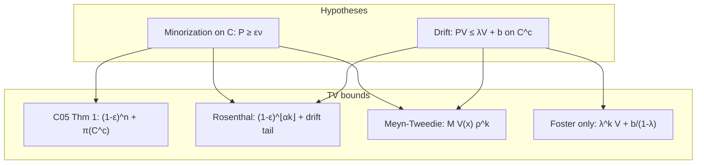

# Geometric ergodicity: Meyn–Tweedie and Rosenthal conditions

Companion to `restricted_gibbs_minorization _v4.md` (Theorem 1),
`JOINT_GAMMA_BETA_TV_CERTIFICATE.md` §5, and `LOGIT_SINGLE_GROUP_SAFE_REGION.md` §4.6.

**Status:** reference note — standard Markov-chain theory mapped to the C05 certificate
vocabulary.

---

## 0. Why two frameworks appear in this package

Three related TV bounds coexist in the inst notes. They answer different questions:

| Bound | Typical form | Drift? | Minorization? | Truncation / escape? |
|-------|----------------|--------|---------------|----------------------|
| **C05 Theorem 1** (Rosenthal Prop. 2 only) | \((1-\varepsilon)^n + \pi(C^c)\) | No | Yes (\(\varepsilon\)) | Yes (\(\delta=\pi(C^c)\)) |
| **Rosenthal (1995) full** | \((1-\varepsilon)^{\lfloor\alpha k\rfloor} + \text{drift tail}\) | Yes (\(\lambda,b\)) | Yes (\(\varepsilon\)) | Implicit in drift term |
| **Meyn–Tweedie simplified** | \(M\,V(x_0)\,\rho^k\) | Yes (in \(\rho\)) | Yes (in \(\rho\)) | Absorbed in \(M\) |

**Key point:** the **second addend** in C05 Theorem 1 is **truncation bias**
(Lemma 1: \(\|\pi(\cdot\mid C)-\pi\|_{TV}=\pi(C^c)\)), **not** the Foster drift
plateau. Rosenthal’s full bound **combines drift and minorization in one
inequality**; Meyn–Tweedie often **folds both into a single rate** \(\rho\).

---

## 1. Setup

Let \(P(x,\cdot)\) be the transition kernel of a time-homogeneous Markov chain
on \((\mathcal X,\mathcal B(\mathcal X))\) with invariant probability measure
\(\pi\). Write

\[
(PV)(x) := \int_{\mathcal X} V(y)\,P(x,dy) = \mathbb E[V(X_1)\mid X_0=x].
\]

For a measurable set \(C\), write \(\mathbb I_C(x)\) for its indicator and
\(C^c=\mathcal X\setminus C\).

---

## 2. The fundamental conditions

### 2.1 Minorization (Doeblin on a small set)

There exist a **small set** \(C\subseteq\mathcal X\), a constant
\(\varepsilon\in(0,1]\), and a probability measure \(\nu(\cdot)\) such that

\[
\boxed{
P(x,\cdot)\ \ge\ \varepsilon\,\nu(\cdot)
\qquad\text{for all }x\in C.
}
\]

**Package map (C05).** \(C=\widetilde C_d\), \(\nu=Q(\cdot\mid\widetilde C_d)\)
(or untruncated refresh \(Q\) on the unrestricted chain), \(\varepsilon=
\varepsilon_d Q(\widetilde C_d)\) on the restricted kernel. See
`restricted_gibbs_minorization _v4.md` Lemma 17.

### 2.2 Geometric drift (Foster–Lyapunov)

There exist a **Lyapunov function** \(V:\mathcal X\to[1,\infty)\) and constants
\(\lambda\in(0,1)\), \(b\in[0,\infty)\) such that

\[
\boxed{
(PV)(x)\ \le\ \lambda\,V(x) + b\,\mathbb I_{C^c}(x)
\qquad\text{for all }x\in\mathcal X.
}
\]

**Equivalent convention (drift off \(C\)).** Some sources state the same
condition as \((PV)(x)\le \lambda V(x)+b\) for all \(x\notin C\), with no extra
\(b\) on \(C\). The indicator form above adds the constant \(b\) only on the
**complement** \(C^c\).

> **Indicator convention.** Occasional expositions write \(b\,\mathbb I_C(x)\) by
> mistake. The standard Meyn–Tweedie / Rosenthal hypothesis is drift **outside**
> the small set (or with \(b\) on \(C^c\)). Verify against the cited theorem before
> plugging in numbers.

**Package map (joint certificate).** On \(\widetilde{\mathcal R}=\widetilde C_d
\times\widetilde B(\delta_2)\), use

\[
V(\gamma)=1+\tfrac12\|\gamma-\gamma^\star\|_{P_{11}}^2
\quad(\ge 1),
\qquad
\lambda=(\kappa_{\max}^+(\delta_2))^2,
\qquad
b=1-\lambda+\tfrac q2+C_\beta,
\]

with \(\kappa_{\max}^+\) from Chapter C03’s \(A=P_{11}^{-1/2}SP_{11}^{-1/2}\),
\(S=P_{12}P_{22}^{-1}P_{21}\), computed **uniformly on compact**
\(\widetilde B(\delta_2)\). See `JOINT_GAMMA_BETA_TV_CERTIFICATE.md` §5.3 and
`CHAPTER_C03_P_AND_A_MATRICES_BY_LIKELIHOOD.md` §I.4.

**Shift from \(V_0=\tfrac12\|\cdot-\gamma^\star\|_{P_{11}}^2\).** If
\((PV_0)(x)\le \lambda_0 V_0(x)+b_0\), then with \(V=1+V_0\),
\((PV)\le \lambda V + (1-\lambda+b_0)\), matching \(V\ge 1\).

---

## 3. Rosenthal (1995) total-variation bound

**Reference.** Rosenthal, J.S. (1995). *Minorization conditions and convergence
rates for Markov chain Monte Carlo.* JASA 90(430), 558–566. Theorem 12 (coupling /
regeneration form) is applied explicitly in
`LOGIT_SINGLE_GROUP_SAFE_REGION.md` §4.6.

### 3.1 Classic two-term TV bound

If §2.1–2.2 hold, then for any start \(x_0\in\mathcal X\), any \(k\in\mathbb N\),
and any **coupling trade-off** \(\alpha\in(\lambda,1)\),

\[
\boxed{
\|P^k(x_0,\cdot)-\pi\|_{TV}
\ \le\
(1-\varepsilon)^{\lfloor \alpha k\rfloor}
\;+\;
\frac{U}{\alpha}
\left(
\frac{1+2b+\lambda V(x_0)}{1+2b/(1-\lambda)}
\right)
\alpha^{k}.
}
\]

**Reading the two terms.**

| Term | Mechanism |
|------|-----------|
| \((1-\varepsilon)^{\lfloor\alpha k\rfloor}\) | **Minorization** on \(C\): regeneration / fresh start at rate \(\varepsilon\) when on \(C\) |
| \(\frac{U}{\alpha}(\cdots)\alpha^k\) | **Drift**: return to \(C\) and Lyapunov accumulation controlled by \(\lambda,b,V\) |

Both \(\varepsilon\) and \(\lambda\) appear. Weakening either slows convergence.

### 3.2 Auxiliary constants (Rosenthal)

Choose \(\alpha\in(\lambda,1)\) (common default: \(\alpha=(1+\lambda)/2\)).

\[
U \;:=\; 1 + 2b + \lambda\,\Bigl[\sup_{x\in C} V(x)\Bigr].
\]

If \(C=\{x:V(x)\le d\}\) is a **sublevel set** of \(V\), then \(\sup_{x\in C}V(x)
\le d\).

**Coupling-time form** (as in `LOGIT_SINGLE_GROUP_SAFE_REGION.md` §4.6, with
\(C=1-\lambda\) in the drift notation there): for any \(r\in(0,1)\),

\[
P(T>k)\ \le\
(1-\varepsilon)^{rk}
\;+\;
\alpha^{-k}(\alpha\Lambda)^{rk}
\Bigl[1+\frac{b}{1-\lambda}+V(x)\Bigr],
\]

with explicit \(\alpha^{-1}=(1+2b+\lambda d)/(1+d)<1\) when \(C=\{V\le d\}\) and
\(d>2b/(1-\lambda)\). TV follows from \(P(T>k)\) via the standard coupling
inequality.

### 3.3 C05 Theorem 1 as a **special case** (minorization + truncation only)

`restricted_gibbs_minorization _v4.md` Theorem 1 proves, **without invoking drift**,

\[
\|P_n(x,\cdot\mid C_d)-\pi\|_{TV}
\ \le\
(1-\varepsilon_d)^n + \pi(C_d^c)
\]

by triangle inequality:

1. \(\|P_n(x,\cdot\mid C_d)-\pi(\cdot\mid C_d)\|_{TV}\le(1-\varepsilon)^n\)
   — Rosenthal Proposition 2 / Doeblin on \(C_d\) only;
2. \(\|\pi(\cdot\mid C_d)-\pi\|_{TV}=\pi(C_d^c)\) — Lemma 1 (truncation).

The second term is **static target mismatch**, not Foster drift. Full Rosenthal
(§3.1) adds the drift term when the chain starts **outside** \(C\) or when
dynamic escape from \(C\) must be controlled.

---

## 4. Meyn–Tweedie simplified bound

**References.** Meyn, S.P. and Tweedie, R.L. (1993). *Markov Chains and
Stochastic Stability*; Roberts, G.O. and Rosenthal, J.S. (1997, 2004) surveys.

When explicit Rosenthal constants are unwieldy, a **structural** bound is:

\[
\boxed{
\|P^k(x_0,\cdot)-\pi\|_{TV}\ \le\ M\,V(x_0)\,\rho^k,
\qquad
M>0,\ \rho\in(0,1).
}
\]

### 4.1 Combined rate from drift and minorization

Both hypotheses (§2) enter **one** exponent \(\rho\). A standard Roberts–Rosenthal
recipe (one-step minorization on \(C\), block length \(m_0\)) is

\[
\rho \;=\; \max\!\Bigl(
(1-\varepsilon)^{1/m_0},\ \alpha
\Bigr),
\qquad
\alpha\in(\lambda,1).
\]

Interpretation:

- \((1-\varepsilon)^{1/m_0}\) — refresh strength on \(C\);
- \(\alpha\) — drift contraction toward \(C\).

The prefactor \(M\) depends on \(\sup_{C}V\), \(b\), and \(E_\pi[V]\) (often
requires \(E_\pi[V]<\infty\)).

### 4.2 Drift-only two-term escape bound (no minorization)

Foster alone controls **escape** from a set. For hitting / tail probabilities,

\[
P^k(x_0,A^c)\ \le\
\lambda^{k-1} V(x_0) + \frac{b}{1-\lambda}
\]

(see `RATE_Ac_BOUNDS_BY_LIKELIHOOD.md` §9, Proposition Esc-\(n\)). This is a
**different** two-term split: geometric decay + plateau. **Minorization does not
appear** in this formula.

---

## 5. How the bounds relate (diagram)

---

## 6. Certificate instantiation (two-block GLMM)

| MT / Rosenthal object | C05 / joint certificate choice |
|----------------------|--------------------------------|
| State space \(\mathcal X\) | \(\widetilde{\mathcal R}=\widetilde C_d\times\widetilde B(\delta_2)\) (restricted kernel) |
| Small set \(C\) | \(\widetilde C_d=\{\Psi(\gamma)\le d\}\) (times \(\widetilde B\) in product form) |
| \(V(x)\ge 1\) | \(V(\gamma)=1+\tfrac12\|\gamma-\gamma^\star\|_{P_{11}}^2\) |
| \(\lambda\) | \((\kappa_{\max}^+(\delta_2))^2\) from matrix \(A\) (Chapter C03) |
| \(b\) | \(1-\lambda+\tfrac q2+C_\beta\) after \(+1\) shift |
| \(\varepsilon\) | \(\varepsilon_d Q(\widetilde C_d)\), \(\varepsilon_d=e^{-d}\varepsilon(\gamma^\star)\) |
| \(\pi(C^c)\) | \(\delta=\pi_\gamma(\widetilde C_d^{\,c})\) (+ \(\delta_2\) for \(\beta\) in joint TV) |
| \(\alpha\) or \(r\) | Numerically optimize in \((\lambda,1)\) for target sweep count \(k\) |
| Compactness of \(\widetilde B\) | Required so \(\kappa_{\max}^+<1\), \(b<\infty\), and \(\lambda<1\) are **uniform** |

**Design order (joint note §5.4).**

1. Choose \(\delta_2\), build compact \(\widetilde B(\delta_2)\) with weight floor.
2. Compute \(\kappa_{\max}^+(\delta_2)\) → \(\lambda=(\kappa_{\max}^+)^2\).
3. Calibrate \(d(\delta)\) from B-spectrum on \(\widetilde B\) → \(\varepsilon\).
4. Assemble TV: C05 \((1-\varepsilon)^n+\delta\) **plus** Rosenthal/MT drift term if
   the chain is not assumed to stay in \(\widetilde C_d\), **plus** \(\delta_2\)
   for joint escape.

---

## 7. Practical optimization notes

1. **Small set trade-off.** Smaller \(C\) often improves \(\lambda\) (easier drift
   back to center) but **shrinks** \(\varepsilon\) (less overlap with refresh measure
   \(\nu\)). Rosenthal’s \(\alpha\) balances the two terms in §3.1.

2. **Optimize \(\alpha\).** For fixed \((\lambda,\varepsilon,b,V(x_0),k)\), search
   \(\alpha\in(\lambda,1)\) to minimize the RHS of §3.1 at the target \(k\).

3. **When to use which bound.**
   - **Certified C05 pipeline:** \((1-\varepsilon)^n+\delta\) is the primary
     minorization + truncation certificate.
   - **Dynamic escape / starts outside \(C\):** add Rosenthal §3.1 or Foster §4.2.
   - **Qualitative geometric ergodicity:** Meyn–Tweedie §4.1 suffices.

4. **Gaussian exact target (Chapter C03).** When the posterior is multivariate normal
   and \(\lambda^\*=\kappa_{\max}(A)<1\) globally, Claim 2 + Theorem 3 give explicit
   decay without Foster–Lyapunov — MT is the fallback for non-Gaussian / restricted
   chains.

---

## 8. References in this repository

| File | Content |
|------|---------|
| `restricted_gibbs_minorization _v4.md` §2.4 | Theorem 1: \((1-\varepsilon)^n+\pi(C^c)\) |
| `JOINT_GAMMA_BETA_TV_CERTIFICATE.md` §5 | Joint \(\widetilde B\) + drift instantiation |
| `LOGIT_SINGLE_GROUP_SAFE_REGION.md` §4.6 | Rosenthal (1995) Theorem 12, coupling-time form |
| `RATE_Ac_BOUNDS_BY_LIKELIHOOD.md` §8–§9 | Foster drift (invalid globally for logit); Esc-\(n\) |
| `CHAPTER_C03_P_AND_A_MATRICES_BY_LIKELIHOOD.md` §I.4 | Matrix \(A\), \(\lambda^\*=\kappa_{\max}\) |

**External.** Rosenthal (1995); Meyn & Tweedie (1993); Roberts & Rosenthal (1997,
2004).

**Application note (this package).** Explicit \(\gamma\)-marginal constants and
Rosenthal assembly: `inst/GAMMA_MARGINAL_DRIFT_MINORIZATION_ROSENTHAL.md`.
