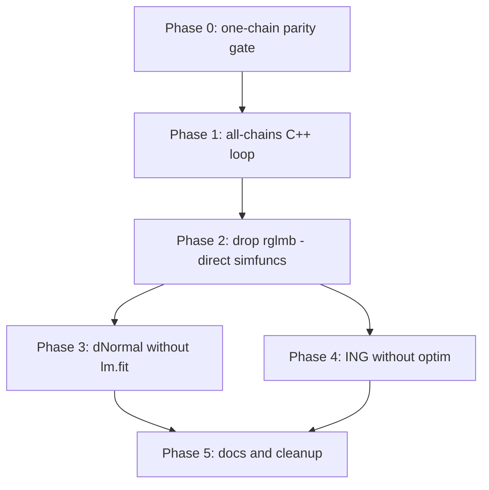

# Plan: Block 2 all-chains C++ migration (zero R callbacks)

Maintainer-facing plan to move the **Block 2 inner loop** off R and eliminate
**all R callbacks** on the hot path used by `rGLMM_sweep` /
`glmerb` (`R_engine`).

Related: `inst/ARCHITECTURE_glmerb.md`, legacy full sweep in
`two_block_rNormal_reg_v5_cpp_export`.

---

## Goal

After migration, one inner sweep’s Block 2 phase is:

```
rGLMM_sweep
  └── .Call(two_block_block2_all_chains_cpp_export, ...)   # single entry
        └── C++ for (m) sweeps × for (i) chains × for (k) RE components
              ├── two_block_align_b_to_xhyper_cpp          # already native
              ├── dNormal  → native conjugate draw         # no rglmb, no lm.fit
              └── ING      → native rIndepNormalGammaReg   # no rglmb; no optim (Phase 4)
```

**Non-goals (this plan):**

- Block 1 C++ migration — see [`inst/PLAN_block1_cpp_migration.md`](PLAN_block1_cpp_migration.md).
- Bit-exact RNG parity with R reference (statistical parity at large `n` only).
- Removing legacy v5 driver (`two_block_rNormal_reg_v5`) — may reuse its Block 2 logic.

---

## Current state (what “use_cpp_block2 = TRUE” actually does)

| Layer | Location | R callbacks? |
|-------|----------|--------------|
| Chain loop | R `for (i in 1:n)` in `.two_block_block2_all_chains` | R loop only |
| Per chain | `.Call(two_block_block2_one_chain_cpp_export)` | One `.Call` per chain |
| Align | `two_block_align_b_to_xhyper_cpp` | **None** |
| Block 2 draw | `two_block_block2_rglmb_gamma` | **`stats::gaussian()`**, **`rglmb()`** per RE component |
| Inside `rglmb` | `rindepNormalGamma_reg` / `rNormal_reg` | R wrapper overhead; see below |

So today’s “C++ Block 2” only removes the R align + batch write loop; **every RE
component still crosses into R via `rglmb()`**.

Legacy v5 (`twoBlockGibbs.cpp` ~1705–1742) already calls **`rNormalReg()`** and
**`rIndepNormalGammaReg()`** directly (no `rglmb`), but:

- v5 Block 2 **does not align** `b` to `X_hyper` row order (v6 path does).
- `rNormalReg()` still calls **`lm.fit`** (R).
- `rIndepNormalGammaReg()` still calls **`optim()`** (R) before envelope simulation.

---

## R callback inventory (Block 2 hot path)

| Callback | Where | Needed for Block 2? | Remove how |
|----------|-------|---------------------|------------|
| R `for` over chains | `.two_block_block2_all_chains` | No | Phase 1: all-chains export |
| `rglmb()` | `two_block_block2_rglmb_gamma` | No | Phase 2: direct C++ simfuncs |
| `stats::gaussian()` | `two_block_gaussian_family_r` | No | Phase 2: drop with `rglmb` |
| Parse `pfamily` SEXP each draw | `block2_prior_prep_v2` exists but unused in v6 path | No | Phase 2: parse once per stage |
| `lm.fit` | `rNormalReg.cpp` (posterior mode) | No for stored γ | Phase 3: conjugate draw / mode without lm.fit |
| `optim` | `rIndepNormalGammaReg.cpp` | Debatable at n=1 | Phase 4: C++ mode finder or cache at ICM |
| `f2` / `f3` R `Function` | Passed into `rNormalReg` from v5 wrappers | No for Gaussian Block 2 | Phase 2–3: Gaussian-only Block 2 entry points |

---

## Target API

### New export (Phase 1 + 2)

```r
two_block_block2_all_chains_cpp_export(
  batch_b,           # J x p_re x n  (or flat array + dims)
  batch_fixef,       # list of n x q_k matrices
  batch_tau2,        # n x p_re
  batch_iters,       # n x p_re
  x_hyper,           # design$X_hyper
  group_levels,
  pfamily_list,      # parsed once inside C++
  ptypes,
  re_names,
  progbar = FALSE,
  progbar_prefix = ""
)
# → list(fixef = ..., tau2 = ..., iters = ...)  same layout as one_chain × n
```

R wrapper:

```r
.two_block_block2_all_chains(..., use_cpp_block2 = TRUE)
  → single .Call(two_block_block2_all_chains_cpp_export, ...)
```

Keep `two_block_block2_one_chain` / `_one_chain_cpp` as **R reference** and unit-test oracle.

### New internal C++ (Phase 2)

Reuse existing pieces:

- `Block2PriorV2`, `block2_prior_prep_v2` (already in `twoBlockGibbs.cpp`)
- `two_block_align_b_to_xhyper_cpp`
- `two_block_update_fixef_row` / assign helpers from v5 batch code

Replace `two_block_block2_rglmb_gamma` with:

```cpp
two_block_block2_component_cpp(
  const NumericMatrix& b_i,
  int col_j,
  const NumericMatrix& X_j,
  const CharacterVector& group_levels,
  const Block2PriorV2& pr,   // parsed once
  NumericVector& gamma_out,
  double& tau2_out,
  double& iters_add
);
```

Dispatch (mirror v5, fix align + use posterior **draws**):

| `pr.is_ing` | C++ call | Read γ from | Read τ² from | Read iters from |
|-------------|----------|-------------|--------------|-----------------|
| false | `two_block_block2_dNormal_draw` (Phase 3) or interim `rNormalReg` | `coefficients(0,_)` | fixed `pr.dispersion` | `1` |
| true | `two_block_block2_ING_draw` (Phase 4) or interim `rIndepNormalGammaReg` | `out[,0]` / `rglmb` `coefficients(0,_)` | `disp_out[0]` | `iters_out[0]` |

**Semantics:** match v5 and `two_block_block2_one_chain` → **`fit_k$coefficients[1, ]`**
(posterior draw). `coef.mode` is for ICM / envelope anchoring only, not Gibbs updates.

---

## Phased work

### Phase 0 — Gate (done / maintain)

- [ ] R reference: `two_block_block2_one_chain` + `use_cpp_block2` one-chain wrapper
  agrees at large `n`, `inner_sweeps = 1` (colMeans of fixef / ranef).
- [ ] Align: R vs `two_block_align_b_to_xhyper_cpp` exact on book-banning + mis-ordered rows.

### Phase 1 — All-chains C++ loop (eliminate R chain loop)

**Work:**

1. Extract `two_block_block2_one_chain_impl(...)` from current export (batch unpack,
   `k` loop, pack `fixef`/`tau2`/`iters`).
2. Add `two_block_block2_all_chains_cpp_export` with C++ `for (i = 0; i < n; ++i)`.
3. Wire `.two_block_block2_all_chains` to one `.Call` when `use_cpp_block2 = TRUE`.
4. Progress bar in C++ (reuse `glmbayes::progress::progress_bar` from v5).

**R callbacks remaining:** still `rglmb` per (chain × component) — **must not stop here** if goal is zero callbacks.

**Acceptance:** Same statistical checks as Phase 0; profiling shows one `.Call` per Block 2 batch instead of `n`.

### Phase 2 — Drop `rglmb` (direct C++ simfuncs)

**Work:**

1. At stage start (or first Block 2 call), build `std::vector<Block2PriorV2> pr2` from
   `pfamily_list` via `block2_prior_prep_v2` (once per RE column width).
2. Replace `two_block_block2_rglmb_gamma` with `two_block_block2_component_cpp` calling:
   - `rNormalReg(...)` / `rIndepNormalGammaReg(...)` as **C++ functions** in
     `glmbayes::sim` namespace (not SEXP eval).
3. Pass dummy / unused `f2`, `f3` only if signature requires until Phase 3–4.
4. Delete or `#ifdef` guard `two_block_gaussian_family_r` and `rglmb` lookup from Block 2 path.
5. **Require align** before every draw (port v5 loop to use `two_block_align_b_to_xhyper_cpp`, not `b_i(_,j)` raw).

**Acceptance:**

- Grep Block 2 path: no `namespace_env`, no `Rcpp::Function rglmb`, no `rglmb(`.
- dNormal + ING: colMeans parity vs R `two_block_block2_one_chain` at large `n`.
- `Ex_16` / `Ex_22` smoke (binomial glmerb, dNormal and ING).

### Phase 3 — dNormal without `lm.fit`

**Work:**

1. Add `two_block_block2_dNormal_draw(n=1, y, X, mu, P, dispersion)`:
   - Stack `[sqrt(w) X; R]` and `[sqrt(w) y; R mu]` (same algebra as `rNormalReg`).
   - Posterior mode = solve via **Armadillo** (`chol`, `solve`), not `lm.fit`.
   - Single draw: `mode + IR * z`, return draw in `coefficients` (same as `rNormalReg`).
2. Use from `two_block_block2_component_cpp` when `!pr.is_ing`.
3. Optional: narrow `rNormalReg` itself later; Block 2 should not depend on that refactor.

**Acceptance:** Block 2 dNormal path has **no** `lm.fit` / `Function("lm.fit")` in call stack.

### Phase 4 — ING without `optim`

**Work:**

1. Profile `rIndepNormalGammaReg(n=1, ...)` — identify `optim()` use (dispersion mode / envelope centering).
2. Options (pick one):
   - **A.** C++ Newton/1-D search for dispersion mode (duplicate `optim` logic in `famfuncs` / envelope code).
   - **B.** Pass **cached mode** from ICM / pilot (`fixef.mode`) into Block 2 when `n=1` and skip re-optimization if tilt unchanged (needs API extension).
   - **C.** Split `rIndepNormalGammaReg` into `*_mode` (once) + `*_draw_given_mode` (hot loop).
3. Wire `two_block_block2_ING_draw` to zero-`optim` path.
4. Keep full `rIndepNormalGammaReg` for standalone `rglmb` / tests.

**Acceptance:** Block 2 ING path has **no** `optim(` call; ING demos (`Ex_20`, `Ex_21`, `Ex_22`) and `test_ing_sampling.R` pass.

### Phase 5 — Docs, flags, cleanup

1. Update `inst/ARCHITECTURE_glmerb.md` Block 2 section (this plan → implemented).
2. `rGLMM_sweep` roxygen: Block 2 is native all-chains C++.
3. Deprecate or document `two_block_block2_rglmb_gamma` as legacy / test-only.
4. Optional flag `use_cpp_block2 = "native"` vs `"rglmb"` for A/B during Phase 2–4 only; remove when Phase 4 done.

---

## File map

| File | Changes |
|------|---------|
| `src/twoBlockGibbs.cpp` | `two_block_block2_component_cpp`, all-chains export, delete `rglmb` path |
| `src/simfuncs.h` | Declarations for new Block 2 helpers |
| `src/export_wrappers.cpp` | Register all-chains export |
| `src/rNormalReg.cpp` or new `twoBlockBlock2Draw.cpp` | Phase 3 conjugate draw |
| `src/rIndepNormalGammaReg.cpp` | Phase 4 mode/draw split |
| `R/two_block_batch_gibbs.R` | Single `.Call` in `.two_block_block2_all_chains` |
| `R/RcppExports.R` | Generated |
| `inst/ARCHITECTURE_glmerb.md` | Status / link |
| `data-raw/test_two_block_block2_cpp.R` (new or extend) | Parity + no-R-callback smoke test |

---

## Validation strategy

1. **Align unit test** — fixed `b_vec`, `X_k`, `group_levels`: R vs C++ `y_k` identical.
2. **One sweep, large n** — `inner_sweeps = 1`, compare `colMeans(batch$fixef[[k]])` and
   `mean(batch$b[,k,])` R reference vs all-chains native (tol ~ 2–3 MC SE).
3. **ING** — `fixef.dispersion` varies, within `[disp_lower, disp_upper]`; τ² couples to Block 1 after separate Block 1 fix.
4. **Regression demos** — `Ex_16` (dNormal), `Ex_22` (ING), `Ex_20`/`Ex_21` (lmerb ING unchanged).
5. **Static check** — CI grep on Block 2 translation units:

   ```bash
   rg 'namespace_env|rglmb|Function\("lm\.fit"\)|Function\("optim"\)' \
     src/twoBlockGibbs.cpp src/twoBlockBlock2*.cpp
   ```

   Must be empty on the merged Block 2 path after Phase 4.

---

## Dependency order



Phases 3 and 4 can proceed in parallel after Phase 2.

---

## Risk notes

| Risk | Mitigation |
|------|------------|
| v5 Block 2 skipped align | Always call `two_block_align_b_to_xhyper_cpp` in new code |
| dNormal γ: draw vs mode | Use `rglmb` / `rNormalReg` **`coefficients`** row; not `coef.mode` |
| ING `optim` cost dominates | Phase 4 split; cache mode at sweep start if needed |
| Mixed dNormal / ING | `Block2PriorV2` per component already handles this |
| Progress / interrupt | Reuse v5 `checkUserInterrupt` + progress helpers |

---

## Definition of done

Block 2 migration is **complete** when:

1. `.two_block_block2_all_chains(..., use_cpp_block2 = TRUE)` makes **one** `.Call` per sweep.
2. No R function is invoked from C++ during Block 2 (no `rglmb`, `lm.fit`, `optim`, `stats::gaussian`, or `eval`).
3. Statistical parity with `two_block_block2_one_chain` on reference models.
4. Architecture doc updated; optional A/B flag removed.
