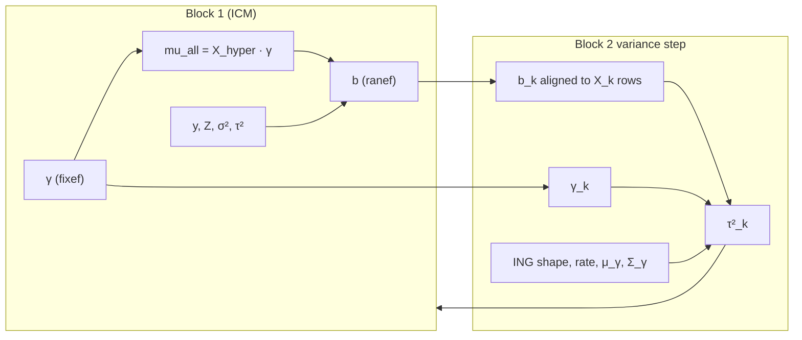

# How τ² is computed in the two-block ING model

This note explains **what enters the τ² update**, how that relates to **`mu_all`**, and how the **`dIndependent_Normal_Gamma`** prior parameters are used. It matches the current implementation in **`R/two_block_tau2_ref.R`** (plug-ins and conservative bounds), **`lmerb_posterior_mean()`** / **`glmerb_posterior_mode()`** (ICM at **fixed** τ²), and Gibbs Block~2 (**`two_block_block2_one_chain()`** → **`rglmb()`**).

---

## 1. Two blocks — different jobs

The Gaussian mixed model is split into two coupled blocks:

| Block | Unknowns | Role |
|-------|----------|------|
| **Block 1** | Random effects `b` (J groups × p_re components) | School-level deviations from the hyper-mean, given data `y` |
| **Block 2** | Hyper-parameters `γ` (population RE structure) and variances `τ²_k` | How RE means vary across schools, and how much residual RE variance remains |

Joint posterior **Gibbs** alternates:

1. **Block 1 ICM** — update `b` and `γ` at **fixed** `(σ², τ²)` plug-ins.
2. **Block 2 Gibbs** — update `τ²_k` (and optionally `σ²`) via **`rglmb()`** at fixed `(b, γ)` from the inner sweep.

**ICM starts** (`lmerb_posterior_mean`, `glmerb_posterior_mode`, `.rLMM_icm_at_start`) use the same fixed-τ² policy and do **not** iterate closed-form τ² updates.

**`mu_all` belongs to Block 1 only.** It is **not** passed into the τ² formula as a separate matrix. The τ² step uses the current random-effect vector `b_k` and hyper coefficients `γ_k`; the fitted hyper-mean `X_k γ_k` is numerically the same as column `k` of `mu_all` when `γ` is the current Block~2 state.



---

## 2. Notation (one RE component k)

Fix a random-effect **column** `k` (e.g. `distracted_ppvt`):

| Symbol | Code | Meaning |
|--------|------|---------|
| J | `length(levels(groups))` | Number of groups (schools) |
| b_jk | `b_mean[j, k]` or `b_k[j]` | Random effect for group j, component k |
| X_k | `design$X_hyper[[k]]` | J × p_k hyper design (rows = schools) |
| γ_k | `fixef[[k]]` | p_k vector of hyper-regression coefficients |
| τ²_k | `tau2[[k]]` | Variance of b_jk around X_k[j,·] γ_k |
| shape, rate | `pfamily$prior_list$shape/rate` | ING Gamma prior on **precision** λ_k = 1/τ²_k |
| μ_γ, Σ_γ | `prior_list$mu`, `Sigma` | Prior on γ_k (Normal part of ING) |

**Per-group hyper-mean** (what `build_mu_all` stores):

$$
\mu_{jk}(\gamma) \;=\; \bigl[X_k \gamma_k\bigr]_j \;=\; X_k[j,\cdot]^\top \gamma_k
$$

```r
mu_all <- build_mu_all(design, fixef)$mu_all  # p_re x J matrix
# mu_all[k, j] == X_hyper[[k]][j, ] %*% fixef[[k]]
```

---

## 3. What does **not** use `mu_all`?

### Plug-in τ² (prior only)

Before any iteration, τ² is set from the **prior spec alone** — no `b`, no `γ`, no `mu_all`:

$$
\tilde\tau^2_k \;=\; \frac{\mathrm{rate}}{\mathrm{shape} - 1}
\quad\text{(ING; requires shape > 1)}
$$

Code: **`.two_block_tau2_plug_in_from_pfamily()`** / **`.two_block_tau2_plug_in_vector()`** (ICM and Σ_ranef). Conservative λ* bounds use **`.two_block_tau2_ref_from_pfamily()`** (`rate/shape`).

From `Prior_Setup_lmebayes` calibration (per component k):

$$
\mathrm{shape}_k = \frac{n_0 + 1 + p_k}{2}, \qquad
\mathrm{rate}_k = \hat\tau^2_k \,\frac{n_0 + p_k - 1}{2}
$$

where \(\hat\tau^2_k\) is the reference `lmer` RE variance and \(n_0\) is the effective prior sample size for dispersion. Then \(\mathrm{rate}_k / (\mathrm{shape}_k - 1) = \hat\tau^2_k\).

---

## 4. Conditional τ² update — the key re-framing

Given **fixed** current estimates `b_k` and `γ_k`, Block~2 treats component k as a **Gaussian regression**:

$$
b_{jk} \;\sim\; \mathcal{N}\!\bigl( X_k[j,\cdot]^\top \gamma_k,\; \tau^2_k \bigr),
\qquad j = 1,\ldots,J
$$

Equivalently, with aligned data vector \(\mathbf{b}\) (length J) and design \(X_k\):

$$
\mathbf{b} = X_k \gamma_k + \varepsilon, \qquad \varepsilon \sim \mathcal{N}(0, \tau^2_k I_J)
$$

**Inputs actually used:**

1. **`b_k`** — J-vector of random-effect estimates (from Block~1 ICM).
2. **`X_k`** — hyper design.
3. **`γ_k`** — current hyper coefficients (only needed explicitly in the closed-form path; `rglmb` re-estimates them jointly).
4. **ING `(shape, rate)`** — prior on λ_k = 1/τ²_k.
5. **ING `(μ_γ, Σ_γ)`** — prior on γ_k (used in the **`rglmb`** path, not in the closed-form τ²-only formula).

**Not used as a separate input:** the `mu_all` matrix. The residual sum of squares uses \(\mathbf{b} - X_k\gamma_k\), which is the same as subtracting `mu_all[k, ]`.

### Alignment

School order in `b_k` must match rows of `X_k`:

```r
b_al <- two_block_align_b_to_xhyper(b_k, X_k, group_levels)
```

---

## 5. Method A — closed-form conditional mode (algebra only)

**Fixes γ_k** at its current value; updates only τ²_k. This is the conjugate
Gamma–Normal algebra for one RE component. Production **Gibbs** Block~2 uses
Method B (**`rglmb()`**); the closed form is not an exported joint-mode loop
(anymore), but the formula still describes what **`rglmb`** collapses to when
γ_k is frozen.

### Step 1 — fitted hyper-mean and RSS

$$
\eta_j = X_k[j,\cdot]^\top \gamma_k
\qquad\text{(same as `mu_all[k, j]`)}
$$

$$
\mathrm{RSS} = \sum_{j=1}^{J} (b_{jk} - \eta_j)^2
$$

Code (same algebra as scratch validators in `data-raw/scratch_tau2_*.R`):

```r
eta <- as.numeric(X_k %*% gamma_k)
rss <- sum((b_al - eta)^2)
m   <- length(b_al)   # m = J
```

### Step 2 — conjugate Gamma posterior on precision

Prior: \(\lambda_k = 1/\tau^2_k \sim \mathrm{Gamma}(\mathrm{shape}, \mathrm{rate})\) (shape–rate parameterization as in the package).

Likelihood contribution from J independent normals with variance τ²_k adds \(J/2\) to the shape and \(\mathrm{RSS}/2\) to the rate:

$$
\mathrm{shape}_{\mathrm{post}} = \mathrm{shape} + \frac{J}{2}, \qquad
\mathrm{rate}_{\mathrm{post}}  = \mathrm{rate} + \frac{\mathrm{RSS}}{2}
$$

### Step 3 — mode of τ²_k

The implementation uses:

$$
\widehat{\tau^2_k}^{\;\mathrm{mode}}
= \frac{\mathrm{rate}_{\mathrm{post}}}{\mathrm{shape}_{\mathrm{post}} - 1}
$$

Code:

```r
rate_post / (shape_post - 1)
```

**Prior mean vs mode:** prior mean of τ²_k is \(\mathrm{rate}/(\mathrm{shape}-1)\); after data, replace with \(\mathrm{rate}_{\mathrm{post}}/(\mathrm{shape}_{\mathrm{post}}-1)\).

### What is ignored in this path?

- **`μ_γ` and `Σ_γ`** do not enter the τ² formula — γ_k is frozen.
- **`mu_all`** — only the column `X_k %*% γ_k` appears, not the full matrix or other RE components.

---

## 6. Method B — `rglmb` Block~2 (`method = "rglmb"`)

Used by **Gibbs sampling** (`two_block_block2_one_chain()`). Same regression setup, but the full ING model is fit:

$$
\gamma_k \sim \mathcal{N}(\mu_\gamma, \Sigma_\gamma), \qquad
\lambda_k = 1/\tau^2_k \sim \mathrm{Gamma}(\mathrm{shape}, \mathrm{rate})
$$

independently, with “responses” \(\mathbf{b} = \mathbf{y}\) and design \(X_k\):

```r
fit_k <- rglmb(
  n = 1L,
  y = b_al,           # aligned random effects
  x = X_k,
  family = gaussian(),
  pfamily = pf_ing    # dIndependent_Normal_Gamma(mu, Sigma, shape, rate)
)
tau2_k <- fit_k$dispersion[1L]
gamma_k_new <- fit_k$coef.mode
```

Here **all four ING pieces matter**:

| ING parameter | Role in `rglmb` |
|---------------|-----------------|
| `mu` (= μ_γ) | Prior mean of hyper coefficients γ_k |
| `Sigma` (= Σ_γ) | Prior covariance of γ_k; sets shrinkage of population effects |
| `shape`, `rate` | Prior on λ_k = 1/τ²_k; combined with RSS after optimizing γ |
| `disp_lower`, `disp_upper` | Truncation window on τ² (envelope sampler); **not** applied in the closed-form algebra |

Because `rglmb` **jointly** finds the conditional mode of \((\gamma_k, \tau^2_k)\), the reported τ² differs from Method A when γ_k is not already at its ING conditional mode. That is why validation at ICM `(b, γ)` can show a large gap for slopes:

| RE component | lmer τ² | closed_form | rglmb |
|--------------|---------|-------------|-------|
| (Intercept) | ~199 | ~157 | ~142–201 |
| distracted_ppvt | ~22.5 | ~4.4 | ~14 |
| distracted_a1 | ~42 | ~10 | ~28–36 |

Closed form **matches frozen-γ conditional mode**. **`rglmb`** refits γ and can differ on slopes (see table below).

---

## 7. Where **`mu_all`** *is* used — Block 1 (contrast)

For completeness, the **random-effect** update (ICM step for `b`) **does** use `mu_all` and τ²:

Prior for group j (all RE components jointly):

$$
b_j \mid \gamma \sim \mathcal{N}\bigl(\mu_j(\gamma),\, \Sigma_b\bigr),
\qquad \Sigma_b = \mathrm{diag}(\tau^2_k)
$$

Posterior mean given `y` (one ICM step):

$$
E[b_j \mid \gamma, y]
= \bigl(Z_j^\top Z_j / \sigma^2 + \Sigma_b^{-1}\bigr)^{-1}
  \bigl(Z_j^\top y_j / \sigma^2 + \Sigma_b^{-1}\,\mu_j(\gamma)\bigr)
$$

where \(\mu_j(\gamma)\) is column j of `mu_all`.

Code: `lmerb_posterior_mean()`, `two_block_conditional_posterior_ranef()`.

**Feedback loop:** Block~1 uses τ² in \(\Sigma_b\). Block~2 uses `b` to update τ². If τ² collapses, `b` shrinks toward `mu_all`, RSS drops, and τ² is driven even lower.

---

## 8. End-to-end flow (Gibbs sampling — random τ²)

```
Start:  σ² = plug-in or draw,  τ²_k = rate_k/(shape_k - 1)  [prior plug-in; no b, no mu_all]

Each outer replicate chain (rlmerb / rGLMM_reg):
  ┌─ Optional ICM start at fixed (σ², τ²) ─────────────────────┐
  │  Build mu_all from current γ                                 │
  │  Update b_j using y, Z, σ², τ², mu_all   (Block 1)        │
  │  Update γ_k using b, τ², Block~2 Normal prior (Block 2)   │
  └──────────────────────────────────────────────────────────────┘
  Inner Gibbs sweeps:
      Block~1 update b  (uses fixed τ² plug-ins in ICM paths)
      Block~2 two_block_block2_one_chain() → rglmb() per ING component
```

ICM helpers stop at fixed τ²; only the Gibbs Block~2 step moves τ²_k.

---

## 9. Quick reference — function map

| Quantity | Function | Uses mu_all? | Uses b? | Uses ING shape/rate? |
|----------|----------|:------------:|:-------:|:--------------------:|
| Prior plug-in τ² (ICM) | `.two_block_tau2_plug_in_from_pfamily()` | No | No | Yes |
| Conservative τ² ref (λ*) | `.two_block_tau2_ref_from_pfamily()` | No | No | Yes |
| Conditional τ² (closed algebra) | *(not exported; see §5)* | No* | Yes | Yes |
| Conditional τ² (Gibbs) | `two_block_block2_one_chain()` → `rglmb()` | No* | Yes | Yes (+ μ_γ, Σ_γ) |
| Block~1 prior Σ_b | `two_block_Sigma_ranef(tau2)` | No | No | No |
| Block~1 μ_j(γ) | `two_block_conditional_prior_ranef()` | **Yes** | No | No (uses τ²) |
| Block~1 posterior b | `two_block_conditional_posterior_ranef()` | **Yes** | via y | No (uses τ², σ²) |

\*Uses \(X_k\gamma_k\), which equals `mu_all[k,]`, but never reads the `mu_all` matrix.

---

## 10. Takeaways

1. **`mu_all` is the Block~1 prior mean of `b` given `γ`.** It is built from `fixef` and `X_hyper`, not from `b` or τ².

2. **The τ² update does not take `mu_all` as an argument.** It uses school-level **`b_k`**, **`X_k`**, current **`γ_k`**, and ING **`shape`/`rate`**. The residual \(\mathbf{b} - X_k\gamma_k\) is algebraically the deviation from `mu_all[k,]`.

3. **Two τ² algorithms differ:** closed form freezes γ; `rglmb` refits γ under \((\mu_\gamma, \Sigma_\gamma)\) and returns a joint mode of \((\gamma, \tau^2)\). Gibbs uses the latter.

4. **Plug-in τ²** comes from the prior only and matches `lmer` reference variance at calibration time; **conditional τ²** shrinks or expands based on how spread out `b` is around the hyper-mean after Block~1.

For a runnable check on `big_word_club`, see `data-raw/scratch_tau2_mle_validate.R`.
